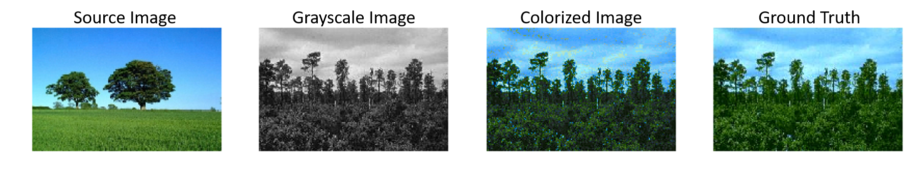

# Colorize Grayscale Images
In this project, I used statistical model, CNN and cGAN to implement three colorization algorithms. Details are as follows. 

## Statistical Model (Welsh)

Here, I implemented **1-to-1** [Welsh algorithm](https://webserver2.tecgraf.puc-rio.br/~scuri/inf1378/pub/welsh.pdf) which is based on pixel similarity. You can run the notebook in `./main/` named `pixel_similarity.ipynb`  directly. This algorithm is easy to understand and performs good if your source image is very similar to the target image. However, it's not automatic at all because we have to search similar source image for every target image manually so as to get good performance. 

## CNN Model

Based on the ideas of [Iizuka](http://iizuka.cs.tsukuba.ac.jp/projects/colorization/en/) and [Zhang](http://richzhang.github.io/colorization/), I built a CNN colorization model whose architecture is as follows. 

In this model, I used the idea of transfer learning and chose MobileNet as the encoder part to extract features from the input image. Then, inspiring by Iizuka, I fused middle-level features and high-level features (classification probability vector) and took it as the input of the decoder part which is as same as Zhang's paper. You can find the notebook and other resources in `./main/CNN/` . The results of the model on the test dataset is as below. 

According to the result, we could see that this model performs well, especially for grass, land, trees and sky which appears a lot in the training dataset.  However, for some images, its predictions are not so robust. 

## cGAN Model

Here, I used the architecture of  [pix2pix](https://phillipi.github.io/pix2pix/) as my cGAN colorization model. The notebook that I used to train is called `cGAN_colorization.ipynb` which could be found in `./main/` also. Its results are as below. 

 

The results show that cGAN does do a great job on the task of colorization. Its predictions are close the ground truth and it's more robust than the CNN model. 

## More Applications

### Colorize legacy black and white images

I used the cGAN model which performs better than the other two models to colorize four legacy black and white images. The results are like this.

Well, it performs not so bad. If we could add more old images into our training dataset, perhaps we could get a better result on these legacy images. 

### Dash App

I also developed a dash app which is user-interactive. It means that users could upload any grayscale image that they want to be colorized into the app and then they could get the result within 1s. Here is one thing to be note, the dash app has not be deployed yet, therefore if you want to try this application, you could find `DashApp.ipynb` in `./app/` folder and run it cell by cell. The notebook is end to end which means you do not have to revise anything while using it. 

## Something Else...

In `./pretrainedModel/` folder, you could find the weights file for CNN and cGAN. The cGAN generator weight file is too big to upload, but you could download it [here](http://www.columbia.edu/~hl3099/csu/generator_epoch60_weight_100.h5). 

This project is just my alpha version of studying on colorization, if you're also interested in colorization and want to dig into this topic a little bit deeper, feel free to contact me and let's play with colorization together! 

### \### Small is Big  

 
